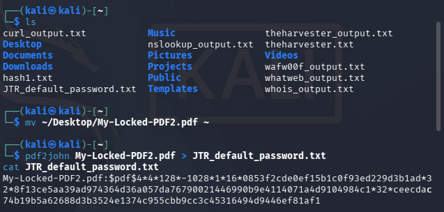
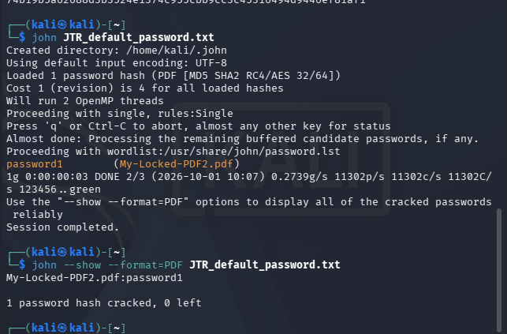
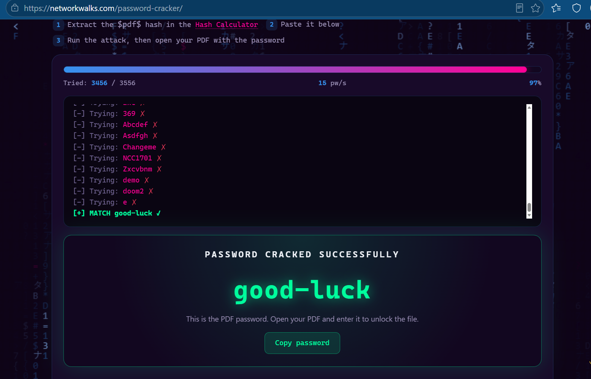

## Week 3: Cryptographic Hash Extraction & Password Auditing

### Executive Summary
During Week 3 of the Network Walks Cybersecurity Virtual Internship, practical laboratories focused on offline credential recovery, cryptographic hash parsing, and dictionary-based brute-force attacks. The modules covered local command-line operations using Kali Linux and John the Ripper (JTR), as well as browser-based hash analysis utilities to target password-protected documents.

---

## Technical Objectives
- **Hash Signature Parsing:** Extract embedded encryption hashes from password-protected PDF files using specialized utility scripts.
- **Wordlist Attacks:** Conduct targeted dictionary attacks utilizing wordlists against extracted cryptographic hashes.
- **Credential Verification:** Audit cracked credentials using local tool databases and runtime flags.
- **CTF Flag Extraction:** Decrypt protected assets to recover validation CTF flags.

---

## Lab Environment & Tools
- **Operating System:** Kali Linux (VirtualBox)
- **Offensive Security Tools:** John the Ripper (`john`), `pdf2john`
- **Analysis Tools:** Network Walks Online Hash Calculator & Password Cracker
- **Target Files:** `My-Locked-PDF1.pdf`, `My-Locked-PDF2.pdf`

---

## Module 1: Local Password Cracking with John the Ripper

### Step 1: Initial Hash Extraction Attempt & Troubleshooting
Initial execution of `pdf2john` failed due to the target PDF being stored in the desktop directory rather than the active terminal path:

```bash
pdf2john My-Locked-PDF2.pdf > JTR_default_password.txt
cat JTR_default_password.txt
```

*Output:* `File not found: My-Locked-PDF2.pdf`

---

### Step 2: File Relocation and Successful Hash Extraction
The target document was relocated from the Desktop path to the user home directory. The extraction command was then re-executed, successfully writing the hash string to `JTR_default_password.txt`:

```bash
mv ~/Desktop/My-Locked-PDF2.pdf ~
pdf2john My-Locked-PDF2.pdf > JTR_default_password.txt
cat JTR_default_password.txt
```

The extracted `$pdf$` hash structure contained algorithm revision flags, encryption lengths, and salt parameters:
```text
My-Locked-PDF2.pdf:$pdf$4*4*128*-1028*1*16*0853f2cde0ef15b1c0f93ed229d3b1ad*32*8f13ce5aa39ad974364d36a057da76790021446990b9e4114071a4d9104984c1*32*ceecdac74b19b5a62688d3b3524e1374c955cbb9cc3c45316494d9446ef81af1
```



---

### Step 3: Executing the Dictionary Attack & Credential Verification
John the Ripper was initiated against `JTR_default_password.txt` using the standard wordlist (`/usr/share/john/password.lst`):

```bash
john JTR_default_password.txt
```

The tool identified the hash format as `PDF [MD5 SHA2 RC4/AES 32/64]` and cracked the hash in under 3 seconds:
- **Recovered Password:** `password1`

The recovered password was subsequently confirmed from the JTR cracked database:

```bash
john --show --format=PDF JTR_default_password.txt
```



---

## Module 2: Online Hash Extraction & Dictionary Attack

### Step 1: Hash Parsing and Dictionary Attack Execution
1. Uploaded `My-Locked-PDF1.pdf` to the Hash Calculator interface to generate the raw `$pdf$` hash.
2. Pasted the extracted hash string into the dictionary attack engine.
3. Executed an automated search against candidate wordlists at a rate of 15 pw/s.
4. At 97% completion (3,456 / 3,556 candidate passwords tested), a positive match was confirmed:
   - **Cracked Password:** `good-luck`



---

### Step 2: PDF Decryption and Flag Capture
1. Opened the locked PDF file and entered the recovered credential `good-luck` to decrypt the contents.
2. Retrieved the completion flag from the decrypted document:
   - **Flag:** `nw{cybersecurity_flag_captured_2608}`


---

## Security Analysis & Key Takeaways
- **Credential Entropy Vulnerability:** Both recovered credentials (`password1` and `good-luck`) were compromised rapidly due to reliance on predictable dictionary entries.
- **Offline Cryptanalysis Exposure:** Document-level hashes can be extracted and audited offline, completely removing detection barriers such as account lockouts or rate-limiting.
- **Defensive Best Practices:** Passphrase length, character complexity, and modern encryption standards (such as AES-256 revisions) remain necessary to defeat offline dictionary and rule-based permutation attacks.
